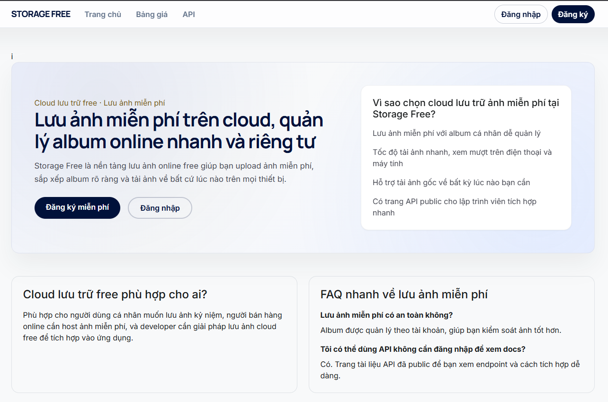
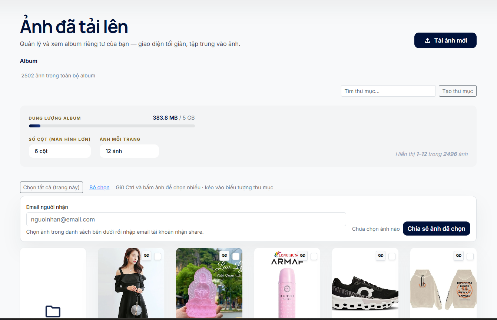
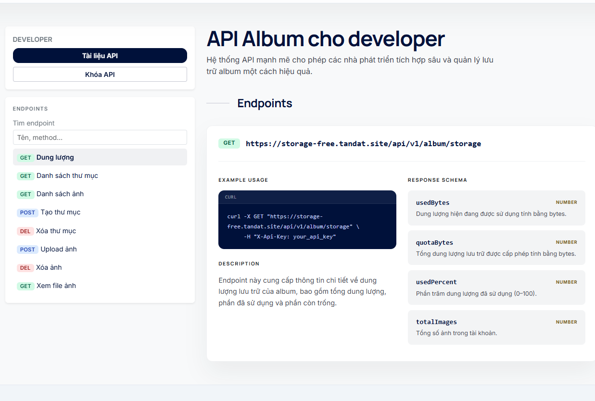

# Storage Free

### Nền tảng lưu ảnh online với album cá nhân, upload hàng loạt và API cho developer

Storage Free là một nền tảng lưu ảnh online với album cá nhân, upload hàng loạt và API dành cho developer.

---

## Dự án này làm gì?

Storage Free giúp người dùng:

- lưu ảnh online trên cloud
- quản lý ảnh theo album và thư mục
- upload nhiều ảnh trong một lần
- xem lại và tải lại ảnh nhanh
- chia sẻ ảnh cho tài khoản khác trong hệ thống

Ngoài ra, dự án còn có khu vực dành cho developer để:

- tạo API key
- upload ảnh bằng API
- quản lý album từ hệ thống bên ngoài

---

## Mình đã làm những gì trong dự án này?

- Thiết kế pipeline xử lý ảnh nền để trải nghiệm upload mượt hơn.
- Thiết kế và phát triển toàn bộ luồng upload ảnh nhiều file.
- Xây hệ thống album cá nhân theo thư mục.
- Tạo cơ chế chia sẻ ảnh giữa các user.
- Xây media endpoint để kiểm soát quyền truy cập ảnh.
- Tạo khu vực developer portal và API key management.
- Phát triển REST API cho upload và quản lý album.
- Chuẩn bị khả năng chạy thực tế với Docker và database.

---

## Hình ảnh dự án

### Trang chủ

### Album người dùng

### Upload ảnh

### API docs cho developer

---

## Công nghệ sử dụng

- ASP.NET Core MVC
- .NET 9
- Entity Framework Core
- MySQL
- Hangfire
- JWT Authentication
- API Key Authentication
- Razor Views
- Bootstrap
- Docker

---
